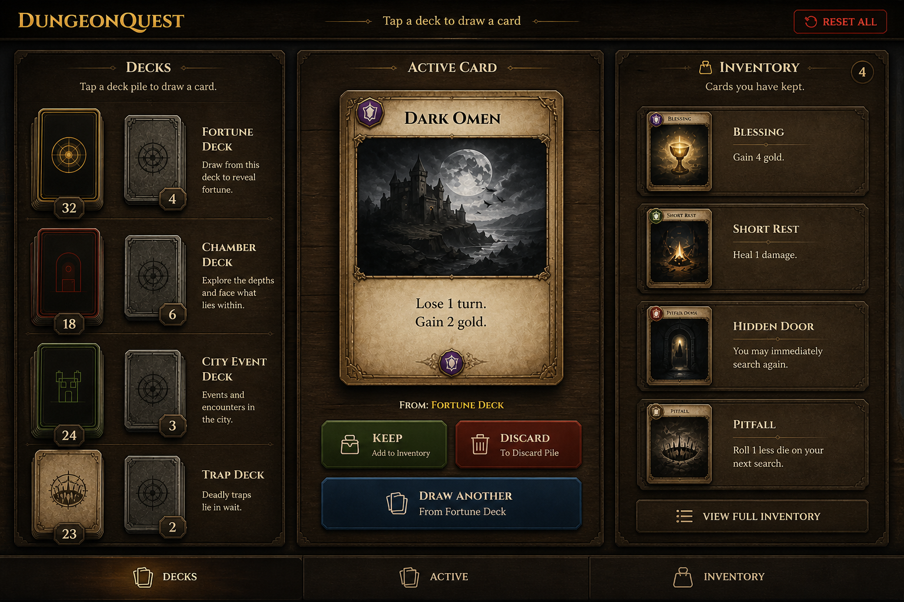
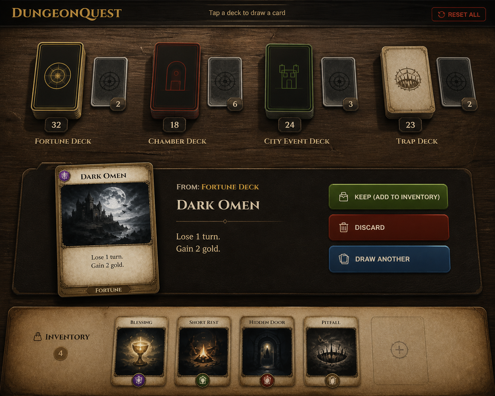

# DungeonQuest Companion

A PWA card deck companion for **DungeonQuest Revised Edition** (Fantasy Flight Games). Manage multiple decks, draw cards, track inventory, and persist game state across sessions — all in the browser, no install required.

## Screenshots

| Desktop | Mobile |
|---------|--------|
|  |  |

## Features

- Draw cards from multiple decks with a flip animation
- Track drawn items in a persistent inventory; consume them when used
- Per-deck discard pile with reshuffle back into draw pile
- Full game reset restores all decks to initial shuffled state
- State persists via `localStorage` — resume where you left off
- Offline-capable PWA — install to home screen, works without a connection

## Tech Stack

Vanilla HTML, CSS, and JavaScript. [Alpine.js 3](https://alpinejs.dev) loaded from CDN for reactive state. No build step, no npm, no bundler.

## Running Locally

```bash
# any static file server works
python3 -m http.server 8000
# or
npx http-server
```

Then open `http://localhost:8000`.

Alternatively, open `index.html` directly in a browser (note: service worker requires a server origin).

## Deployment

GitHub Actions deploys to GitHub Pages on every push to `main`. See `.github/workflows/deploy.yml`.

## Adding a New Game

1. Create `games/<game-id>.json` following the schema in `games/dungeonquest.json`:
   ```json
   {
     "id": "my-game",
     "name": "My Game",
     "decks": [
       {
         "id": "draw",
         "name": "Draw Pile",
         "backImage": "images/cards/my-back.svg",
         "cards": [
           { "name": "Card Name", "count": 3, "type": "item", "description": "..." }
         ]
       }
     ]
   }
   ```
2. Create `themes/<game-id>.css` with your colour and font overrides (see `themes/dungeonquest.css` and `docs/styleguide/dungeonquest.md` for guidance).
3. Update the `load()` call in `app.js` to point at your new JSON file.
4. Add new card back images to `images/cards/` and list all new assets in `sw.js` for offline caching.

## Project Structure

```
dungeon-quest-helper/
├── index.html          — app markup (Alpine.js directives)
├── app.js              — Alpine store, deck logic, persistence
├── style.css           — responsive layout, animations
├── manifest.json       — PWA manifest
├── sw.js               — service worker (offline cache)
├── games/              — JSON deck configurations
├── themes/             — per-game CSS themes
├── images/cards/       — card back SVGs
├── icons/              — PWA icons
└── docs/styleguide/    — design documentation
```

## Spec

Full technical specification (goals, constraints, invariants, task log, bug history) lives in [`SPEC.md`](SPEC.md).
